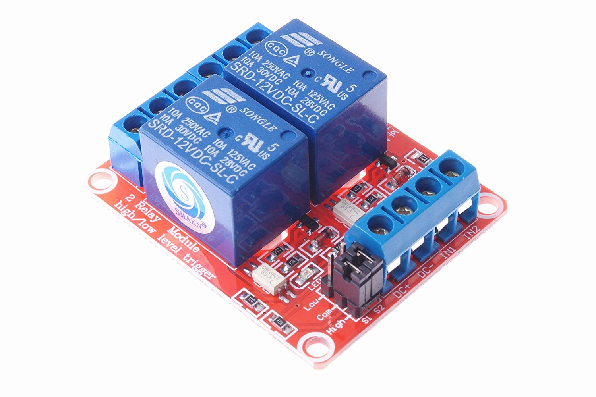
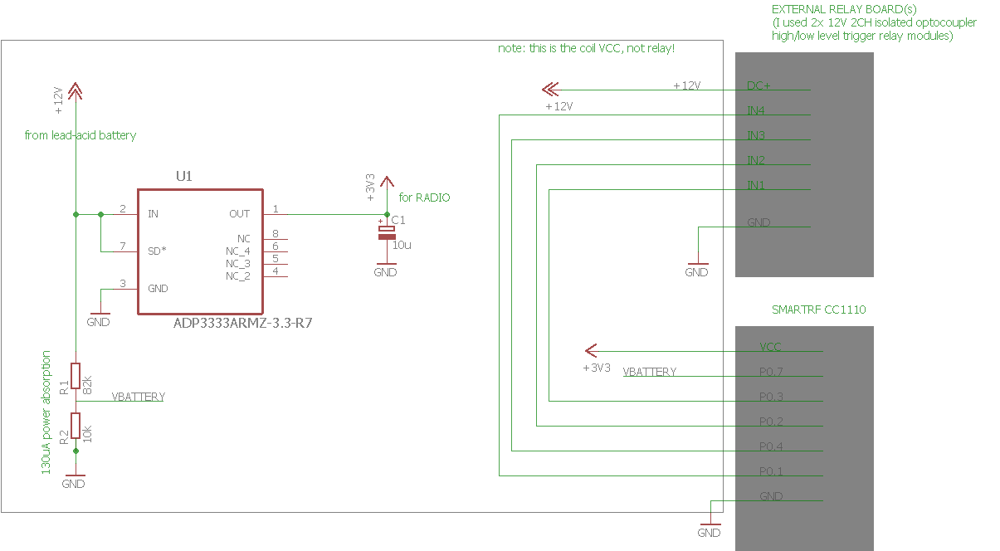
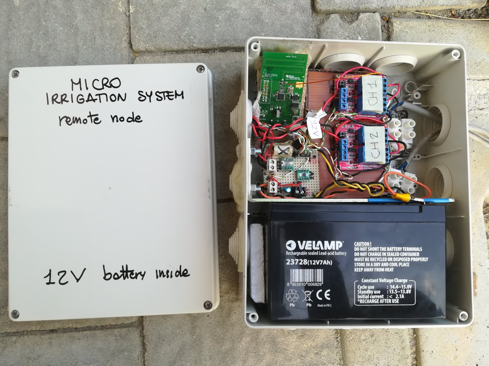
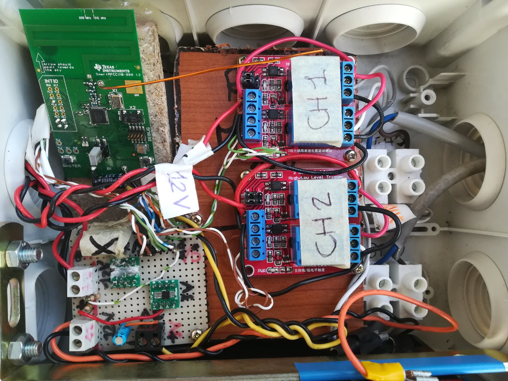

# Micro-irrigation Control #

This project contains source code for:
 - a Linux embedded system (in my case Olimex Lime2 A20 single board computer)
 - digital radio transceivers (in my case a couple of Texas Instruments CC1110 boards)

The aim of the system is to provide via a web interface the possibility to open or close remote relays,
which in my casea are attached to electrovalves that open or close some water flows (in my case to provide
irrigation in my garden).
However the target of the system is much more generic and you can attach to the "remote" node pretty much
anything you like.

## Prerequisites ##

This project assumes that you have:
1. an embedded Linux system, in particular Olimex Lime2 is assumed here.
   Moreover I tested this project only with a recent Debian-variant "armbian" installed, using DeviceTree overlays for
   accessing the SPI bus of the embedded system. See https://docs.armbian.com/User-Guide_Allwinner_overlays/.
   The DeviceTree config file used in my case is [available here](software-lime2/lime2_device_tree/armbianEnv.txt).
2. two digital radios, based on Texas Instruments CC1110, operating in the 433 or 868/915 Mhz ISM bands.
   See e.g., http://www.ti.com/tool/CC1110EMK868-915 for the commercial boards used in this project.
   This choice is motivated by the fact that these frequencies provide high wall penetration and low battery 
   consumption compared to other radio technologies like the well-known Wi-Fi.


## Architecture ##

This picture gives an overview of the whole system:


## Hardware Design ##

The hardware design for the remote node is available as Cadsoft Eagle schematics (see https://www.autodesk.com/products/eagle/overview)
in the hardware-remote folder. The design is based on 3 major parts:
1) the CC1110 evaluation module which provides the antenna, the CC1110 radio+micro and its programming interface. 
   See http://www.ti.com/tool/CC1110EMK868-915 ; this can be connected via SPI bus to an embedded SoC Linux system
   like a Raspberry Pi or similar boards. I used the Olimex Lime2. I documented the [wiring between the CC1110 board and the Lime2](docs/wiring-cc1110-lime2.md).
2) one or more commercial relay boards. These are usually unbranded chinese boards which you can find by googling 
   for e.g. "DC 12V 2CH isolated high low level trigger relay module". Here's a picture of the one I used:
   
   The important aspect to keep in mind is that in my hardware design the CC1110 will drive the inputs of these
   relay modules directly (thus applying 3.3V as logic high signal) so that they must be both opto-isolated and
   sensitive enough (most modules out there expect 5V as logic high signal).
3) a custom "glue" board to provide right power and cabling between the other 2 parts. 
   I built this on a simple stripboard (https://en.wikipedia.org/wiki/Stripboard).
   This board connects the battery source (a 12V lead-acid battery in my case) to the radio module and relay module.

This is the overview of the custom glue board (extremely simple):



Finally a small caveat: typical electrovalves will require a positive pulse to move the internal valve to the OPEN
position and a negative pulse to go in the CLOSE position. This requires the driving hardware to be able to 
invert the output polarity. This can be achieved using 2 channels of a relay module and wiring the electrovalve
as shown in this picture:


Note that the normally-open (NO) contacts are attached to the 12V battery while the normally-closed (NC) contacts
are attached to the ground. When no signal is applied to the relay module, the electrovalve has both its wires
connected to the 12V and thus no current circulates. When one of the relay modules is triggered then the electrovalve
will receive +12V or -12V. Thus the polarity applied to the electrovalve can be controlled by triggering just one 
of the 2 relay channels.


## Battery Duration ##

The current consumption budget of the remote node when the firmware puts the radio in sleep mode is:
 - 100 uA for the 12V to 3V current regulator (in the hardware schematic shown above an ADP3333 low dropout 300mA-max regulator was chosen)
 - 130 uA for the static resistor divider used for battery voltage probing
 - between 1 and 200 uA for the CC1110 depending on the power mode selected by firmware (power mode 1 or 2)

For a total consumption of about 430uA.
The current consumption budget of the remote node when the firmware puts the radio in RX mode is dominated by the CC1110 
and will be around 22mA. With current firmware settings the RX window lasts for about 1sec.
Of course the "remote" node also needs to transmit an acknowledge to the "lime2" node (when a command is received in that RX window)
raising current consumption up to 36mA but the TX time is so short that can be neglected in computations.

Assuming that a 7Ah lead-acid battery is used for powering the system, and that the sensor will wake up once every 7 seconds to check for
commands over the radio channel, the battery life can be easily computed using e.g. https://oregonembedded.com/batterycalc.htm.

Data entered on that page in my case is:
 - 7000mAh capacity rating
 - 100uA + 130uA + 200uA ~0.5mA current consumption of device during sleep
 - ~22mA current consumption of device during wake (radio in RX mode)
 - 3600sec / (7sec + 1sec) = 450 number of wakeups per hour
 - 1000 ms duration of wake time
 
The result is a battery duration of **~78 days**.

The computations above do not include of course the current consumed to actually activate the relays and to move the
electrovalve from the OPEN to the CLOSE position or viceversa. However such event is typically very rare (let's say once per day)
and thus can be ignored to simplify computation.

Of course it's clear that the more the remote node remains in sleep mode the longer the battery will last. This resolves to a basic
tradeoff in the design criteria: by increasing the sleep time the battery life is increased but the latency for delivering commands
from the lime2 node to the remote node increases as well.


## Firmware and Software Design ##

Both the remote node and the lime2 nodes have custom firmware written in C and based upon Texas Instruments BSP and MRFI packages for CC1110.
The directory with the source code is "firmware-cc1110-lime2-remote"; it contains a project for the [IAR Embedded Workbench for 8051](https://www.iar.com/iar-embedded-workbench/) IDE. Unfortunately if you need to change it (you will probably need unless you use exactly
the same evaluation module from TI with the same pinout), you have to either buy the IAR software or use the 30days evaluation trial;
indeed the 4-kb limited edition is not suitable for any project employing CC1110 radio.

The firmware can be built in 2 modes: REMOTE and LIME2 to produce the firmware for the 2 peers of this project.
[SPI protocol](docs/spi-protocol-cc1110-lime2.md) documentation is available and provides an overview of supported SPI commands.
[Radio protocol](docs/radio-protocol.md) documentation is available as well.

The firmware logic of the LIME2 node can be summarized as follows:
 - poll the SPI RX buffer looking for commands
 - whenever an SPI TURNON/TURNOFF command is received from the Lime2 Linux system, then a radio packet is filled with that command 
   and sent (there is no real addressing logic: we assume only 1 receiver will be present); 
   for each transmitted command, the system waits for an over-radio acknowledge and, if that arrives, the data contained in the
   acknowledge packet is saved; if it does not arrive, the command is retransmitted until the acknowledge arrives;
 - whenever an SPI STATUS command is received from the Lime2 Linux, then the data contained from the most recent acknowledge packet
   is provided to the Lime2 Linux.
   
In practice the LIME2 node acts as an SPI-to-radio bridge.
The presence of the "transaction ID" in both command packets and acknowledge packets allows all parts of the system to discard duplicates
(e.g. the remote node can discard multiple commands having the same transaction IDs, which may be transmitted by the lime2 node when 
the acknowledge packet gets lost) and the Lime2 Linux system to understand if a command has been successfully received by the remote node.

The firmware logic of the REMOTE node can be summarized as follows:
 - sleep for a certain amount of time, using a low-power timer to wake up the MCU;
 - when the MCU wakes up, the radio is turned on in RX mode and the remote node waits for a certain time window for incoming commands;
 - whenever a radio TURNON/TURNOFF command is received from the Lime2 node, then the command data is saved and an acknowledge
   radio packet is generated and transmitted; the system then waits some time to allow the Lime2 node to receive the acknowledge and
   stop repeating the command. After such "cool down" time window, the remote node drives its GPIO pins to turn on/off the relay modules
   which in turn will open/close the electrovalves.

The presence of the ADC read of the battery in each acknowledge allows to exploit the uplink channel remote->lime2 node to also 
provide an indication of how much battery power is left.


## Source code ##

Tree of contained source code is:

```
 firmware-cc1110-lime2-remote:  this is the firmware written in C for both the CC1110 "lime2" node and the "remote" node. 
  \-- source
       \-- apps    
            \-- lime2.c: contains the firmware source code for the node attached to the Linux embedded system over SPI
                remote.c: contains the firmware source code for the node attached to the electrovalve
  
 software-lime2: this is the PHP code for the Linux embedded system
  \-- spidev_test:  this is the Linux kernel utility written in C that provide an easy way to communicate with devices over SPI
      web:          this folder contains the PHP code implementing the specific communication protocol over-SPI;
                    this code must be run inside a regular web server (e.g. Apache, lighttpd or nginx) and uses a mix of PHP and
                    Javascript to open WebSockets to get updates about SPI activities.
      bin:          this folder contains PHP code to implement a WebSocket server using Ratchet (http://socketo.me/);  
                    the WebSocket server is used by Javascript code to fetch updates from SPI.
```

Main source files to understand the application:

 - [main.c](firmware-cc1110-lime2-remote/source/apps/main.c)
 - [lime2.c](firmware-cc1110-lime2-remote/source/apps/lime2.c)
 - [remote.c](firmware-cc1110-lime2-remote/source/apps/remote.c)


## Installation ##

TO BE WRITTEN


## Final Result ##

This how my final assembly of the remote node looks like:




These are instead a screenshot of the web interface:


It is very very simple and is currently integrated with my other project: http://github.com/f18m/light-media-center


## Project Status ##

As of Aug 2018 I put "on the field" (literally) my assembly with the software and firmare of this GIT repo.
It works well so far. 
I will develop and maintain this project in my free time, though I don't plan to add any new feature.
Eventually I will improve the look and feel of the web interface but that's pretty much it.


## Similar Projects ##

The most comprehensive project similar to this is MySensors: https://www.mysensors.org

Similar projects designed to drive relay boards that are directly connected to the Linux system (without the radio bridge):

- http://www.logicaprogrammabile.it/come-pilotare-elettrovalvola-bistabile-usando-2-rele/ (in Italian)
- https://github.com/ondrej1024/crelay
- https://github.com/darrylb123/usbrelay

Similar projects designed to drive REMOTE relay boards (not BATTERY powered though):
- https://github.com/shanet/RelayRemote
