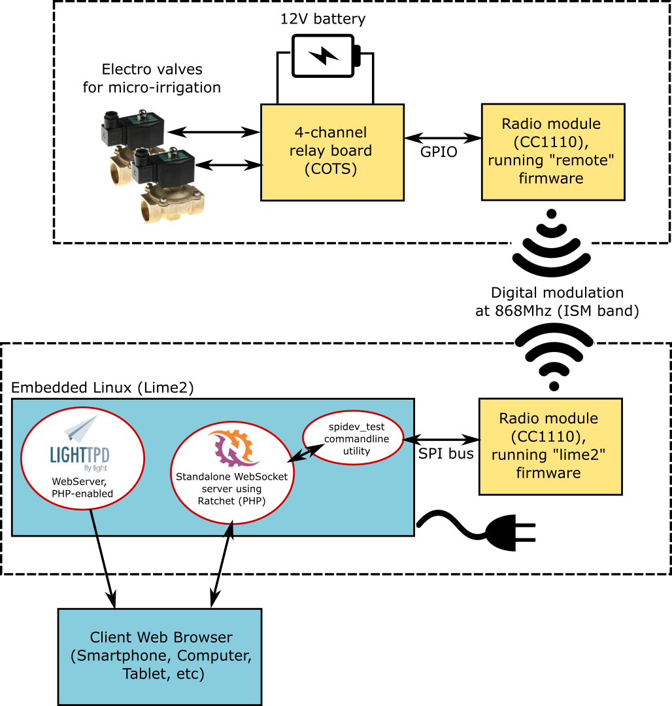

# Micro-irrigation Control #

This project contains source code for 
 - a Linux embedded system (in my case Olimex Lime2 A20 single board computer)
 - digital radio transceivers (in my case a couple of Texas Instruments CC1110 boards)

The system aim is to provide via a web interface the possibility to open or close a remote relais,
which in my case is attached to an electrovalve that opens or closes water flow (to my home irrigation system).
However the target of the system is much more generic and you can attach to the "remote" node pretty much
anything you like.

## Prerequisites ##

This project assumes that you have:
1. an embedded Linux system, in particular Olimex Lime2 is assumed here.
   Moreover I tested this project only with a recent Debian-variant "armbian" installed, using DeviceTree overlays for
   accessing the SPI bus of the embedded system. See https://docs.armbian.com/User-Guide_Allwinner_overlays/.
2. two digital radios, based on Texas Instruments CC1110 

## Architecture ##

## Source code ##

Tree of contained source code is:

 firmware-cc1110-lime2-remote:  this is the firmware written in C for both the CC1110 "lime2" node and the "remote" node. 
  \-- source
       \-- apps    
            \-- lime2.c: contains the firmware source code for the node attached to the Linux embedded system over SPI
                remote.c: contains the firmware source code for the node attached to the electrovalve
  
 software-lime2: this is the PHP code for the Linux embedded system
  \-- spidev_test:  this is the Linux kernel utility written in C that provide an easy way to communicate with devices over SPI
      web:          this folder contains the PHP code implementing the specific communication protocol over-SPI;
                    this code must be run inside a regular web server (e.g. Apache, lighttpd or nginx) and uses a mix of PHP and
                    Javascript to open WebSockets to get updates about SPI activities.
      bin:          this folder contains PHP code to implement a WebSocket server using Ratchet (http://socketo.me/);  
                    the WebSocket server is used by Javascript code to fetch updates from SPI.

## Installation ##

## Similar Projects ##

- http://www.logicaprogrammabile.it/come-pilotare-elettrovalvola-bistabile-usando-2-rele/ (in Italian)
